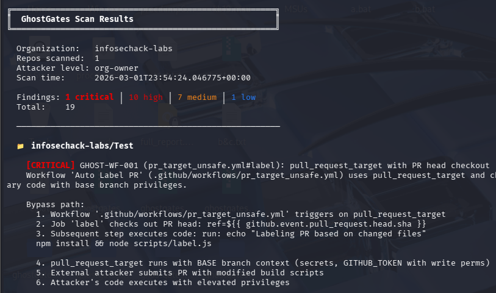

# GhostGates


GhostGates is a CI/CD security analysis tool that identifies **structural bypass paths** in GitHub Actions workflows, branch protections, environments, rulesets, and OIDC trust policies.

Traditional CI/CD scanners detect **misconfigurations**. GhostGates models **how controls interact** to uncover attack paths that allow bypassing those controls without violating any technical policy.



---

## Table of Contents

- [Why GhostGates Exists](#why-ghostgates-exists)
- [Quick Start](#quick-start)
- [Example Output](#example-output)
- [What GhostGates Detects](#what-ghostgates-detects)
- [Example Finding](#example-finding)
- [Threat Model](#threat-model)
- [Installation](#installation)
- [Usage](#usage)
- [Risk Ranking](#risk-ranking)
- [Policy Audit](#policy-audit)
- [Recon (Attack Surface)](#recon-attack-surface)
- [Output Formats](#output-formats)
- [GitHub Action](#github-action)
- [Token Permissions](#token-permissions)
- [Rule Catalog](#rule-catalog-15-rules)
- [Architecture](#architecture)
- [Development](#development)
- [Adding New Rules](#adding-new-rules)
- [How GhostGates Compares](#how-ghostgates-compares)
- [Roadmap](#roadmap)
- [License](#license)

---

## Why GhostGates Exists

Organizations spend real effort configuring CI/CD security gates — required reviewers, branch protections, environment approvals, OIDC trust policies. Once configured, these controls are treated as enforced.

They often aren't.

The problem isn't misconfiguration. It's that **controls interact in ways that create structural bypass paths** — gaps where an attacker at a given privilege level can circumvent a gate entirely without violating any technical policy. The gate appears enforced. The bypass works anyway.

Real examples:

- A workflow using `pull_request_target` that checks out PR head code gives any external attacker privileged execution — no credentials required
- Branch protections with `enforce_admins` disabled make required reviews purely cosmetic for anyone with repo-admin access
- OIDC trust policies configured without an environment gate allow deployments from any branch in the repo
- Rulesets in evaluate mode log violations but block nothing — they look enforced in the UI

Traditional scanners flag the misconfiguration. GhostGates finds the bypass path.

It models **how controls interact**, maps the gap between configured and actually enforced, and shows the exact attack steps needed to exploit it.

---

## Quick Start

```bash
git clone https://github.com/InfoSecHack/ghostgates
cd ghostgates
pip install -e .
export GITHUB_TOKEN=ghp_your_token_here
ghostgates scan --org my-org
```

---

## Example Output

### Risk Ranking

```
╔══════════════════════════════════════════════════════╗
║  GhostGates Risk Ranking                             ║
╚══════════════════════════════════════════════════════╝

  Organization:  my-org
  Repos ranked:  3

    #  Repository                    Score   Tier       Findings     Flags
  ─────────────────────────────────────────────────────────────────────────
    1  my-org/payments-api            282    CRITICAL   1C 10H 7M 1L  ⚠ external  ⚠ OIDC  ⚠ prod
    2  my-org/web-app                  47    HIGH       2H 1M
    3  my-org/docs                      2    LOW        1L

  Total risk: 331 across 3 repos
  1 CRITICAL-tier repos
```

### Policy Audit

```
╔══════════════════════════════════════════════════════╗
║  GhostGates Policy Audit                             ║
╚══════════════════════════════════════════════════════╝

  Policy:      ghostgates-policy.yml
  Repos:       47 in scope (3 excluded)
  Compliant:   31/47 (66%)
  Total gaps:  14

  ── Policy Gaps ──

  my-org/payments-api    3 gaps
    ✗ 🔒 enforce_admins: false (expected: true) [main]
    ✗ ⚙️ max_default_permissions: write (expected: read)
    ✗ 🔑 require_environment_claim: missing

  ── Compliant ──
    ✓ 31 repos fully compliant
```

### Attack Surface (Recon)

```
╔══════════════════════════════════════════════════════╗
║  GhostGates Attack Surface                           ║
╚══════════════════════════════════════════════════════╝

  ── Attacker-Controlled Workflow Execution ──  (requires: NO CREDS)

    my-org/payments-api
      → PR head checkout in pr_target_unsafe.yml  (GHOST-WF-001)

  ── Secrets Exposure ──  (requires: NO CREDS)

    my-org/payments-api
      → secrets: inherit → deploy.yml (deploy_unsafe.yml)  (GHOST-WF-003)

  ── Cloud Credential Theft (OIDC) ──  (requires: repo-write)

    my-org/payments-api
      → id-token: write without env gate (oidc_deploy.yml#deploy-aws)  (GHOST-OIDC-002)
```

---

## What GhostGates Detects

Each finding includes:

- **Bypass path** — numbered attack steps showing exactly how the gate is bypassed
- **Evidence** — raw configuration values proving the bypass exists
- **Attacker level** — minimum privilege needed (external → org-owner)
- **Remediation** — specific fix with configuration guidance and direct settings URL
- **Instance key** — unique identifier (rule + repo + context) for stable tracking across scans

---

## Example Finding

> **Note:** Simplified for readability. Actual terminal output formatting may differ.

```
[CRITICAL] GHOST-WF-001
Rule:      pull_request_target + PR head checkout (supply chain attack)
Workflow:  .github/workflows/pr_target_unsafe.yml
Attacker:  external (no credentials required)

Bypass Path:
  1. Workflow triggers on pull_request_target
  2. Job checks out the PR head branch:
       uses: actions/checkout@v3
       with:
         ref: ${{ github.event.pull_request.head.sha }}
  3. pull_request_target executes with BASE branch privileges
     and write-scoped GITHUB_TOKEN — not the fork's read-only token
  4. External attacker forks the repo and opens a PR with malicious code
  5. Malicious code runs in the privileged workflow context

Evidence:
  trigger:     pull_request_target
  head_ref:    github.event.pull_request.head.sha
  permissions: write

Impact:
  Full code execution in a privileged workflow context.
  Attacker can exfiltrate secrets, push commits, or poison
  build artifacts — from a fork PR with no write access.

Remediation:
  Replace pull_request_target with pull_request, or restructure
  the workflow to never check out untrusted PR head code in a
  privileged context. If pull_request_target is required, perform
  all untrusted code execution in a separate unprivileged job.
```

---

## Threat Model

GhostGates evaluates CI/CD security across a spectrum of attacker capability levels. Every rule specifies the **minimum privilege required** to exploit the bypass — so findings are scoped to what's actually reachable by a given attacker, not just theoretical worst-case.

| Attacker Level | Access | Typical Vector |
|----------------|--------|----------------|
| `external` | None — public repo only | Fork PR, open issue |
| `org-member` | Member of the GitHub organization | Internal PRs, org-level runners |
| `repo-write` | Can push branches and open PRs | Branch push, PR creation |
| `repo-maintain` | Can manage some branch protections | Protection overrides |
| `repo-admin` | Repository administrator | Settings, branch protection overrides |
| `org-owner` | Organization owner | Full org control |

This model matters because the blast radius of a bypass depends entirely on who can trigger it. A CRITICAL finding exploitable by `external` attackers — like GHOST-WF-001 — is a different class of risk than a HIGH finding that requires `repo-admin`.

---

## Installation

```bash
pip install -e ".[dev]"
```

Requires Python 3.11+.

---

## Usage

### Authentication

Set your GitHub token as an environment variable (recommended):

```bash
export GITHUB_TOKEN=ghp_your_token_here
```

Or pass it directly (not recommended — appears in shell history):

```bash
ghostgates scan --org my-org --token ghp_xxx
```

### Live Scan

```bash
# Scan all repos in an org
ghostgates scan --org my-org

# Scan specific repos with verbose output
ghostgates scan --org my-org --repos api,web -v

# Scan with risk ranking appended
ghostgates scan --org my-org --rank

# JSON output for CI integration
ghostgates scan --org my-org --format json > report.json

# SARIF output for GitHub Code Scanning
ghostgates scan --org my-org --format sarif > results.sarif

# Markdown report
ghostgates scan --org my-org --format md -o report.md

# Simulate specific attacker level
ghostgates scan --org my-org --attacker repo-write
```

### Offline Analysis

After a scan, gate models are stored locally. Re-run analysis without API calls:

```bash
ghostgates offline --org my-org --db ghostgates.db
ghostgates offline --org my-org --db ghostgates.db --attacker repo-admin --format json
```

### List Rules

```bash
ghostgates list-rules
ghostgates list-rules --format json
```

### Show Stored Results

```bash
ghostgates show --org my-org
ghostgates show --org my-org --scan-id 3 --format md
```

### Drift Detection

Detect new bypasses introduced between scans:

```bash
# Compare latest scan to previous scan
ghostgates diff --org my-org

# JSON output for CI integration
ghostgates diff --org my-org --format json

# Compare specific scan IDs
ghostgates diff --org my-org --old-id 3 --new-id 5
```

### Exit Codes

**scan / offline:**

| Code | Meaning |
|------|---------|
| `0` | No findings (or LOW/INFO only) |
| `1` | MEDIUM severity findings |
| `2` | HIGH or CRITICAL findings |

**diff:**

| Code | Meaning |
|------|---------|
| `0` | No new findings since last scan |
| `1` | New findings introduced |

**audit:**

| Code | Meaning |
|------|---------|
| `0` | All repos compliant |
| `1` | Policy gaps found |

Designed for CI/CD pipeline integration — fail the build when critical bypasses exist or policy gaps are detected.

---

## Risk Ranking

Aggregate findings per repo into weighted risk scores for prioritization. Addresses the "wall of findings" problem on large orgs.

```bash
# Standalone (uses latest stored scan)
ghostgates rank --org my-org
ghostgates rank --org my-org --format json
ghostgates rank --org my-org --top 10

# Appended to scan output
ghostgates scan --org my-org --rank
```

**Scoring algorithm:**

Each finding contributes a base score by severity: CRITICAL (50), HIGH (20), MEDIUM (7), LOW (2), INFO (0). Bonus points are added for structural risk factors:

- **+25** if any finding is reachable by an external attacker (no credentials)
- **+15** if any OIDC finding exists (cloud credential risk)
- **+10** if a production environment is involved

Repos are tiered: CRITICAL (≥75), HIGH (≥40), MEDIUM (≥15), LOW (<15).

---

## Policy Audit

Define your organization's security standard in a YAML file, then measure compliance across every repo. This is the feature that produces SOC2 evidence, ISO 27001 audit artifacts, and board-level compliance percentages.

Rare among open-source CI/CD tools — most check generic best practices. GhostGates audit checks YOUR policy.

```bash
# Live scan + audit
ghostgates audit --org my-org --policy ghostgates-policy.yml

# Audit against stored data (no API calls)
ghostgates audit --org my-org --policy ghostgates-policy.yml --offline

# JSON for CI pipelines
ghostgates audit --org my-org --policy ghostgates-policy.yml --format json

# Markdown for reports
ghostgates audit --org my-org --policy ghostgates-policy.yml --format md -o audit.md
```

### Policy File Format

Copy `ghostgates-policy.example.yml` and customize for your org. Only fields you explicitly set are enforced:

```yaml
# ghostgates-policy.yml
policy:
  branch_protection:
    enforce_admins: true
    dismiss_stale_reviews: true
    min_reviewers: 2
    require_codeowners: true
    require_status_checks: true
    block_force_pushes: true

  environments:
    "prod.*":                           # regex pattern matching env names
      required_reviewers: true
      restrict_branches: true
      min_wait_timer: 5
    "staging":
      required_reviewers: true

  workflows:
    max_default_permissions: read
    block_pull_request_target: true
    block_secrets_inherit: true
    block_write_all: true
    block_pr_approval: true

  oidc:
    require_custom_template: true
    require_environment_claim: true

scope:
  include: [".*"]                       # all repos
  exclude: ["docs", ".*-sandbox"]       # skip these
```

**17 policy checks** across branch protection, environments, workflows, and OIDC.

### Four Views, Same Data

GhostGates gives security teams four complementary perspectives from a single scan:

| Command | Perspective | Audience |
|---------|-------------|----------|
| `ghostgates scan` | What's exploitable and how | Security engineering, AppSec |
| `ghostgates rank` | Where to fix first | Security engineering, triage |
| `ghostgates audit` | Are we meeting our standard | CISO, compliance, auditors |
| `ghostgates recon` | What's my attack surface | Red team, pen test |

---

## Recon (Attack Surface)

Reshuffles existing findings into offensive attack questions. Same data as `scan`, organized by what a red teamer asks during recon instead of by repo.

```bash
# Attack surface view from latest scan
ghostgates recon --org my-org

# JSON for tooling
ghostgates recon --org my-org --format json

# Markdown for report
ghostgates recon --org my-org --format md -o recon.md
```

**Six attack surface categories:**

| Category | Question |
|----------|----------|
| Workflow Execution | Which repos allow attacker-controlled code execution in workflows? |
| Secrets Exposure | Which pipelines expose secrets to untrusted contexts? |
| Cloud Credential Theft | Which repos allow unauthorized cloud role assumption? |
| Code to Prod Without Review | Which repos allow code to reach prod without human review? |
| Production Deployment Paths | Which workflows can deploy to production? |
| Review Bypass Paths | Which repos have circumventable branch protections? |

No new API calls. No new rules. Zero additional scan time.

---

## Output Formats

| Format | Flag | Use Case |
|--------|------|----------|
| Terminal | `--format terminal` (default) | Interactive review |
| JSON | `--format json` | CI integration, programmatic analysis |
| Markdown | `--format md` | Reports, documentation |
| SARIF | `--format sarif` | GitHub Code Scanning / Security tab |

### SARIF Integration

Generate SARIF 2.1.0 output for native GitHub Code Scanning integration. Findings appear in the Security tab alongside CodeQL and Dependabot:

```bash
# Generate SARIF
ghostgates scan --org my-org --format sarif > results.sarif

# Upload to GitHub Code Scanning
gh api -X POST /repos/{owner}/{repo}/code-scanning/sarifs \
  --field "sarif=$(gzip -c results.sarif | base64 -w0)" \
  --field "ref=refs/heads/main"
```

Each SARIF result includes a stable fingerprint (`rule_id|repo|instance`) for deduplication across scans.

---

## GitHub Action

Recommended for org owners who want weekly SARIF results in the GitHub Security tab.

```yaml
# .github/workflows/ghostgates-scan.yml
name: GhostGates CI/CD Security Scan

on:
  schedule:
    - cron: '0 9 * * 1'            # Every Monday at 9am UTC
  workflow_dispatch:                 # Manual trigger

permissions:
  contents: read
  security-events: write

jobs:
  ghostgates:
    runs-on: ubuntu-latest
    steps:
      - name: Install GhostGates
        run: pip install git+https://github.com/InfoSecHack/ghostgates.git

      - name: Run scan (SARIF)
        env:
          GITHUB_TOKEN: ${{ secrets.GHOSTGATES_TOKEN }}
        run: ghostgates scan --org ${{ github.repository_owner }} --format sarif > results.sarif

      - name: Upload SARIF to GitHub Security
        uses: github/codeql-action/upload-sarif@v3
        with:
          sarif_file: results.sarif
          category: ghostgates
```

**Required secret:** `GHOSTGATES_TOKEN` — a classic PAT with `repo` + `read:org` scopes, or a fine-grained PAT with Repository Read + Organization Read permissions.

---

## Token Permissions

**Classic PAT:** `repo` + `read:org`. Optionally `admin:repo_hook` for webhook-based environment protections.

**Fine-grained PAT:** Repository Read + Organization Read permissions.

**Token safety:** Tokens are never logged, stored in the database, or included in error messages. All error paths scrub token patterns before raising.

---

## Rule Catalog (15 rules)

### Branch Protection (6 rules)

| ID | Rule | Severity | Min Privilege |
|----|------|----------|---------------|
| GHOST-BP-001 | Admin bypass of required reviews (`enforce_admins` disabled) | HIGH | repo-admin |
| GHOST-BP-002 | Stale review approval persistence (bait-and-switch PRs) | MEDIUM | repo-write |
| GHOST-BP-003 | Required reviews without CODEOWNERS enforcement | LOW | repo-write |
| GHOST-BP-004 | Deployment branches lack protection | MEDIUM | repo-write |
| GHOST-BP-005 | Workflows can approve their own PRs | HIGH | repo-write |
| GHOST-BP-006 | Ruleset in evaluate mode (false enforcement) | HIGH/MEDIUM | repo-write |

> **On admin bypasses:** A common objection to GHOST-BP-001 is *"I'm the admin — I need that flexibility."* The finding isn't about your intended use. It's about what happens when that account is compromised. A stolen maintainer token, a malicious insider, or a supply chain attack on a bot account with admin rights all inherit the same bypass. `enforce_admins: false` means the protection is only as strong as your weakest privileged credential.

### Environment (3 rules)

| ID | Rule | Severity | Min Privilege |
|----|------|----------|---------------|
| GHOST-ENV-001 | Production environment with no required reviewers | HIGH | repo-write |
| GHOST-ENV-002 | Environment allows deployment from any branch | MEDIUM | repo-write |
| GHOST-ENV-003 | Wait timer as only protection (auto-approve) | MEDIUM | repo-write |

### Workflow (4 rules)

| ID | Rule | Severity | Min Privilege |
|----|------|----------|---------------|
| GHOST-WF-001 | `pull_request_target` + PR head checkout (supply chain attack) | **CRITICAL** | **external** |
| GHOST-WF-002 | Workflow with write-all permissions | HIGH | repo-write |
| GHOST-WF-003 | Reusable workflow with `secrets: inherit` | HIGH | repo-write |
| GHOST-WF-004 | Workflow exposes secrets to fork PRs | HIGH | external |

### OIDC (2 rules)

| ID | Rule | Severity | Min Privilege |
|----|------|----------|---------------|
| GHOST-OIDC-001 | Default/broad OIDC subject claim | HIGH | repo-write |
| GHOST-OIDC-002 | OIDC token used without environment gate | HIGH | repo-write |

---

## Architecture

```
GitHub API
    ↓
Collectors (org, repos, environments, workflows)
    ↓
GateModel (per-repo structured data)
    ↓
┌─────────────────────────────────────────┐
│           Rule Engine (15 rules)        │
│   decorator-registered, attacker-level  │
│         parameterized                   │
└─────────────────────────────────────────┘
    ↓                    ↓
Findings              GateModel
    ↓                    ↓
┌──────────┐     ┌──────────────┐
│ Reporting│     │ Policy Audit │
│          │     │              │
│ terminal │     │ YAML policy  │
│ JSON     │     │ 17 checks    │
│ markdown │     │ compliance % │
│ SARIF    │     └──────────────┘
│ rank     │
│ recon    │
└──────────┘
```

Key design principles:

- **GateModel abstraction** — Rules never call APIs. All data is pre-collected into a typed model.
- **Decorator-based rules** — `@registry.rule(...)` auto-registers rules, filterable by attacker level and gate type.
- **Evidence-first** — Every finding includes the raw config values that prove the bypass.
- **Attacker modeling** — Findings are parameterized by minimum privilege level, not just severity.
- **Policy-as-code** — Define your security standard in YAML, measure compliance programmatically.
- **Fail-safe parsing** — The workflow YAML parser never crashes; malformed files produce `parse_errors`, not exceptions.

---

## Development

```bash
# Run all tests
pytest tests/ -v

# Run specific rule tests
pytest tests/test_engine_bp_rules.py -v
pytest tests/test_engine_env_wf_oidc.py -v

# Run new feature tests
pytest tests/test_rank.py -v
pytest tests/test_sarif.py -v
pytest tests/test_policy_audit.py -v
pytest tests/test_recon.py -v

# Run with debug output
pytest tests/ -v --tb=long -s
```

450 tests, ~15K lines of Python.

---

## Adding New Rules

```python
from ghostgates.engine.registry import registry
from ghostgates.models.enums import AttackerLevel, Confidence, GateType, Severity
from ghostgates.models.gates import GateModel
from ghostgates.models.findings import BypassFinding

@registry.rule(
    rule_id="GHOST-XX-001",
    name="My new bypass rule",
    gate_type=GateType.WORKFLOW,
    min_privilege=AttackerLevel.REPO_WRITE,
    tags=("workflow", "custom"),
)
def xx_001_my_rule(gate: GateModel) -> list[BypassFinding]:
    findings = []
    # Check gate model for bypass condition
    # Append BypassFinding with evidence if found
    return findings
```

Then import the module in `ghostgates/engine/__init__.py` and it auto-registers.

---

## How GhostGates Compares

| Tool | What it does | Approach |
|------|-------------|----------|
| [Gato](https://github.com/praetorian-inc/gato) | Exploits GitHub Actions (self-hosted runners, secret exfil) | Offensive exploitation |
| [GitOops](https://github.com/ovotech/gitoops) | Maps user→repo→secret graph paths in Neo4j | Graph traversal (archived) |
| [Actions Attack Diagram](https://github.com/jstawinski/GitHub-Actions-Attack-Diagram) | Reference flowchart of Actions attack paths | Educational diagram |
| **GhostGates** | Audits structural bypass paths + policy compliance + attack surface | Defensive analysis + red team recon |

Gato exploits. GitOops maps. GhostGates audits. They solve different problems.

One of the few open-source tools that unifies branch protections + environments + workflows + OIDC + rulesets into a single structural analysis with attacker-level parameterization and policy-as-code compliance measurement.

---

## Roadmap

- GitLab CI support
- Azure DevOps pipelines
- PyPI package (`pip install ghostgates`)
- Expanded rule catalog
- Pipeline security benchmarking
- Attack graph visualization

---

## License

MIT License. See [LICENSE](LICENSE) for details.
